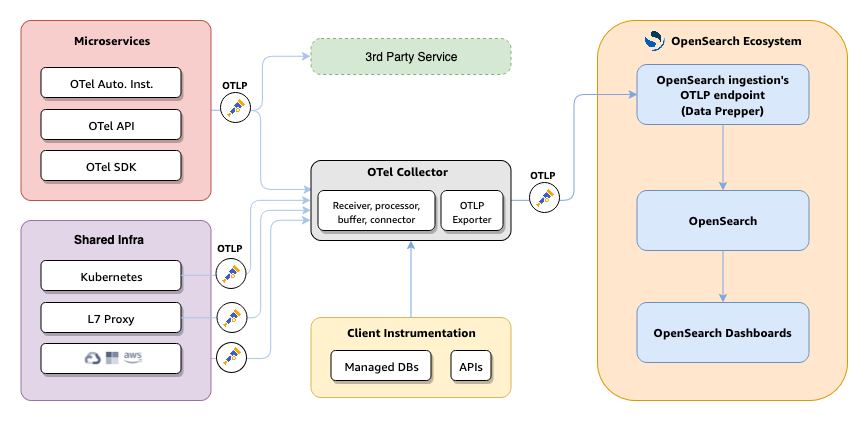

<!-- markdownlint-disable-next-line -->
#  +  OpenTelemetry Demo with OpenSearch

The following guide describes how to setup the OpenTelemetry demo with
OpenSearch Observability using [Docker compose](#docker-compose).

## Docker compose

### Running this demo

```bash
git clone https://github.com/opensearch-project/opentelemetry-demo.git
cd opentelemetry-demo
docker compose up -d
```

## Observability data flow to OpenSearch



### Exploring Traces & Services

1. Trace Analytics relies on you adding instrumentation to your application
   and generating trace data. The OpenTelemetry documentation contains example
   applications for many programming languages that can help you get started,
   including Java, Python, Go, and JavaScript.

2. The OpenTelemetry Collector receives data from the application and formats
   it into OpenTelemetry data.

3. Data Prepper processes the OpenTelemetry data, transforms it for use in
   OpenSearch, and indexes it on
   an OpenSearch cluster.

4. The Trace Analytics OpenSearch Dashboards plugin displays the data in near
   real-time as a series of charts and tables, with an emphasis on service
   architecture, latency, error rate, and throughput.


### Exploring Logs

1. Create an index pattern named `ss4o_logs*` to explore service logs ingested
   in OpenSearch via Data prepper

2. Use PPL/SQL/DQL/Lucene to explorer your logs in OpenSearch Dashboards with discover


## Welcome to the OpenTelemetry Astronomy Shop Demo

This repository contains the OpenTelemetry Astronomy Shop, a microservice-based
distributed system intended to illustrate the implementation of OpenTelemetry in
a near real-world environment.

Our goals are threefold:

- Provide a realistic example of a distributed system that can be used to
  demonstrate OpenTelemetry instrumentation and observability.
- Build a base for vendors, tooling authors, and others to extend and
  demonstrate their OpenTelemetry integrations.
- Create a living example for OpenTelemetry contributors to use for testing new
  versions of the API, SDK, and other components or enhancements.

## Documentation

For detailed documentation, see [Demo Documentation][docs]. If you're curious
about a specific feature, the [docs landing page][docs] can point you in the
right direction.

[docs]: https://opentelemetry.io/docs/demo/
